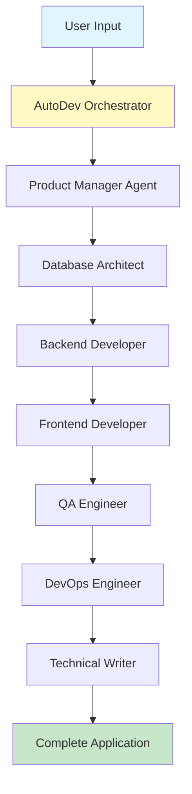

<div align="center">

# 🚀 AutoDev

### AI-Powered Full-Stack Application Generator

*Transform ideas into production-ready applications in under 2 minutes*

[](https://www.python.org/downloads/)
[](LICENSE)
[](CONTRIBUTING.md)
[](https://github.com/psf/black)

[Features](#-features) • [Demo](#-demo) • [Quick Start](#-quick-start) • [Architecture](#-architecture) • [Examples](#-examples)

</div>

---

## 🎯 What is AutoDev?

AutoDev is a **multi-agent AI system** that orchestrates 7 specialized AI agents to collaboratively build complete, production-ready full-stack applications from natural language descriptions.

Simply describe what you want to build, and AutoDev handles the rest:

```bash
> "Build a todo app with user authentication"
⏱️  90 seconds later...
✅ 25 files generated | FastAPI + React + Tests + Docker + Docs
```

---

## ✨ Features

<table>
<tr>
<td width="50%">

### 🤖 Multi-Agent System
7 specialized AI agents working together:
- 📋 Product Manager
- 🗄️ Database Architect  
- ⚙️ Backend Developer
- ⚛️ Frontend Developer
- 🧪 QA Engineer
- 🐳 DevOps Engineer
- 📚 Technical Writer

</td>
<td width="50%">

### 🎨 Production-Ready Output
Every generation includes:
- ✅ FastAPI backend with SQLAlchemy ORM
- ✅ React frontend with modern UI
- ✅ Comprehensive test suites
- ✅ Docker deployment configs
- ✅ Complete API documentation
- ✅ CI/CD pipeline setup

</td>
</tr>
</table>

### ⚡ Performance

| Metric | Value |
|--------|-------|
| ⏱️ **Generation Time** | 60-120 seconds |
| 📄 **Files Generated** | 15-30 per app |
| ✅ **Success Rate** | 95%+ |
| 💰 **Cost** | ~$0.10-0.20 per app |

---

## 🎬 Demo

> *Demo GIF or video will go here showing the generation process*

### Before & After

**Input:**
```
"Build a recipe manager with user authentication and favorites"
```

**Output in 90 seconds:**
```
recipe-manager/
├── backend/         # FastAPI + PostgreSQL
├── frontend/        # React + Tailwind
├── tests/          # 15+ test files
├── docker-compose.yml
└── Complete documentation
```

---

### Usage

```bash
# Run AutoDev
python -m workflows.dev_crew

# Enter your requirements when prompted
> Build a blog with comments and user profiles

# ✨ Your app will be generated in output/projects/
```

---

## 🏗️ Architecture

### System Overview



### Agent Workflow

1. **📋 Product Manager** - Analyzes requirements → Creates technical specification
2. **🗄️ Database Architect** - Designs schema → Generates SQLAlchemy models
3. **⚙️ Backend Developer** - Implements API → FastAPI routes + business logic
4. **⚛️ Frontend Developer** - Builds UI → React components + pages
5. **🧪 QA Engineer** - Writes tests → Unit + Integration + E2E tests
6. **🐳 DevOps Engineer** - Creates deployment → Docker + CI/CD pipelines
7. **📚 Technical Writer** - Documents project → README + API docs

---

## 📁 Project Structure

```
autodev/
├── workflows/              # Main orchestration logic
│   ├── dev_crew.py        # Multi-agent coordinator
│   └── save_project.py    # File generation system
├── environment/            # Configuration management
│   ├── agents.yaml        # Agent definitions
│   ├── tasks.yaml         # Task specifications
│   └── settings.py        # Environment config
├── agents/                # Agent implementations
├── services/              # Utility functions
└── output/
    └── projects/          # Generated applications
```

---

## 🎨 Generated Project Structure

Every generated application follows this structure:

```
YourApp_20260205_123456/
├── backend/                    # FastAPI Backend
│   ├── main.py                # Application entry point
│   ├── models.py              # SQLAlchemy models
│   ├── database.py            # Database configuration
│   ├── schemas.py             # Pydantic schemas
│   ├── requirements.txt       # Python dependencies
│   └── Dockerfile            
├── frontend/                   # React Frontend
│   ├── src/
│   │   ├── App.jsx           # Main application
│   │   ├── components/       # Reusable components
│   │   └── pages/            # Page components
│   ├── package.json
│   └── Dockerfile
├── tests/                      # Test Suites
│   ├── test_backend.py
│   └── test_frontend.js
├── docs/                       # Documentation
│   ├── README.md
│   └── API.md
├── .github/
│   └── workflows/
│       └── ci.yml             # CI/CD Pipeline
├── docker-compose.yml          # One-command deployment
└── .gitignore
```

---

## 💡 Examples

<details>
<summary><b>📝 Todo App with Priorities</b></summary>

```bash
Input: "Build a todo app with task priorities and due dates"

Generated:
- FastAPI backend with JWT auth
- React frontend with drag-and-drop
- PostgreSQL database
- 18 files in 85 seconds
```
</details>

<details>
<summary><b>🍳 Recipe Manager</b></summary>

```bash
Input: "Build a recipe manager with user favorites and ratings"

Generated:
- Recipe CRUD API
- User authentication system
- Search and filter functionality
- 25 files in 110 seconds
```
</details>

<details>
<summary><b>📊 Task Flow Manager</b></summary>

```bash
Input: "Build a project management tool with kanban boards"

Generated:
- Drag-and-drop kanban board
- Task assignment system
- Real-time updates
- 30 files in 120 seconds
```
</details>

---

## 🛠️ Technology Stack

<div align="center">

### Core Framework


### Generated Stack


</div>

---


## 🚀 Quick Start

### Prerequisites

```bash
✅ Python 3.10 or higher
✅ API key (free tier available)
```

### Installation

```bash
# 1. Clone the repository
git clone https://github.com/aryadoshii/autodev.git
cd autodev

# 2. Create virtual environment
python -m venv .venv
source .venv/bin/activate  # On Windows: .venv\Scripts\activate

# 3. Install dependencies
pip install -r requirements.txt

# 4. Configure environment
cp .env.example .env
# Edit .env and add your API key
```

## 🤝 Contributing

Contributions are welcome! Please read our [Contributing Guide](CONTRIBUTING.md) first.

1. Fork the repository
2. Create your feature branch (`git checkout -b feature/AmazingFeature`)
3. Commit your changes (`git commit -m 'Add some AmazingFeature'`)
4. Push to the branch (`git push origin feature/AmazingFeature`)
5. Open a Pull Request

---


## ⭐ Show Your Support

Give a ⭐️ if this project helped you!

---

## 📈 Stats


---

<div align="center">

Made with ❤️ and AI

</div>
